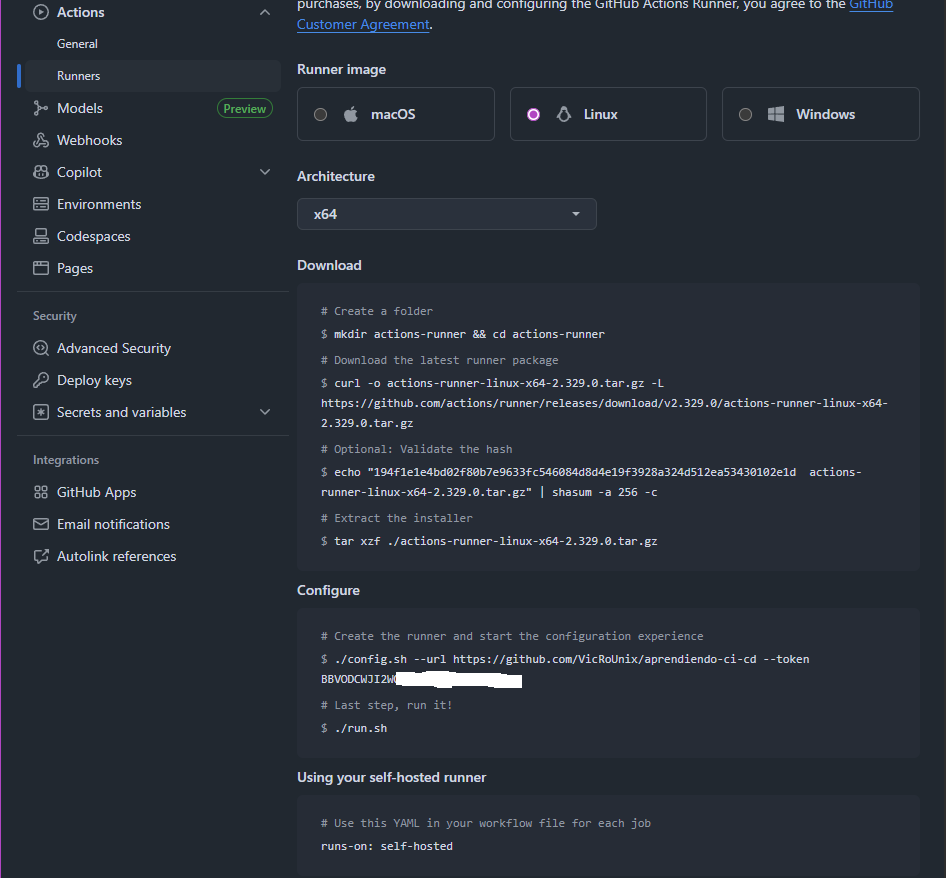

# Self-Hosted Runner
* Como tener nuestra propia maquina que eejcute los workflows de github actions ,en el que podamos hacer pruebas reales, acceso a servicios locales o proyectos donde requerimos de mas control.

---

## 1.Preparemos una maquina (en mi caso Linux Mint 24)
```bash
sudo apt update && sudo apt upgrade -y
sudo apt install -y curl wget git docker.io
sudo usermod -aG docker $USER
newgrp docker
```
## 2.Crear el runner en Github
* 1.Ir al repositorio donde tengas tu aplicacion o donde quieras correr tus worklows, en -> Settings -> Actions -> Runners
* 2.Click en "New self-hosted runner"
* 3.Elegir Linux si lo quieres asi, (en mi caso cogi este) u copiar el token y comandos que da.


## 3.Configuremos el runner
* Tendremos que seguir la guia que nos da la iamgen con sus comandos.
```bash
# En la raiz del repositorio
mkdir actions-runner && actions-runner

# Descargar el ultimo paquete
curl -o actions-runner-linux-x64-2.329.0.tar.gz -L https://github.com/actions/runner/releases/download/v2.329.0/actions-runner-linux-x64-2.329.0.tar.gz

# Opcional: Validar el hash
echo "194f1e1e4bd02f80b7e9633fc546084d8d4e19f3928a324d512ea53430102e1d  actions-runner-linux-x64-2.329.0.tar.gz" | shasum -a 256 -c

# Extraer el instalador
tar xzf ./actions-runner-linux-x64-2.329.0.tar.gz

# Configurar el runner 
./config.sh --url https://github.com/TU_USER/TU_REPO --token TU_TOKEN --name vicrounix_runner --lables self-hosted,linux,vicrounix --work _work --replace

# Vamos a prenderlo!!
./run.sh
```